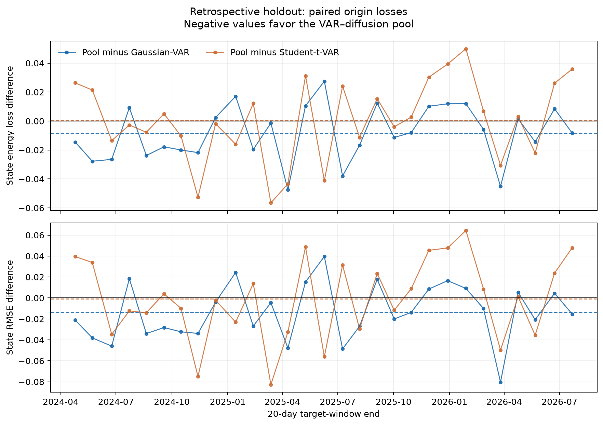

# Diffusion-Enhanced Factor-State Forecasting Through Validation-Selected Distribution Pools

## Abstract

We study whether conditional diffusion models add forecast information beyond
classical linear dynamics in a high-dimensional equity factor model. Daily returns
for an archived December 2023 S&P 500 universe are mapped to a ten-dimensional state:
five mean factors and five principal components of rolling residual log variance.
A stable Gaussian VAR supplies a strong conditional distribution, while a
conditional diffusion model generates nonlinear residual paths. Rather than replace
the VAR, the proposed method forms a validation-selected finite pool of VAR and
diffusion paths.

The experimental workflow separates market selection, model development, final
validation, and a retrospective holdout evaluation. CSI 300 and S&P 500 are compared
using data ending in 2023; S&P 500 is selected before post-2023 observations are
loaded into the scoring pipeline. The final model is trained through 2022, with
checkpoints and pool weights selected on 2023. A one-time computationally locked
holdout evaluation uses observations from 2024-01-02 through 2026-07-29, comprising
645 trading days and 29 non-overlapping 20-day origins. The protocol was frozen on
2026-07-30, after the holdout period had occurred; it was not prospectively
preregistered.

Relative to VAR-GARCH, the pooled forecast reduces the state energy score by 1.83%
and state RMSE by 2.14%. Paired origin bootstraps give 95% intervals of
[-0.0153, -0.0018] for the energy-score difference and
[-0.0232, -0.0041] for state RMSE. The locked composite ratio is 0.9801,
satisfying the recorded holdout decision rule. Against a stronger Student-t VAR, the pool
is statistically tied on energy and slightly better on 20-day state RMSE. It does
not improve return-tail or drawdown calibration. Post-hoc 100-path scoring supports
the Gaussian comparison and beats added ridge, diagonal-AR, nonlinear-AR, and
persistence baselines, but remains inconclusive against Student-t VAR. Observable
portfolio-risk tests show no consistent advantage and identify worse 5% VaR
pinball loss than Gaussian VAR. A preregistered, externally notarized evaluation on
the untouched FTSE 100 market reproduces the pattern on 2024–2026: the
Gaussian-base pool passes its prespecified primary rule with composite 0.98204
(HAC p=0.0017 on both co-primary metrics), while the prespecified Student-t-base
pool is again statistically tied with Student-t VAR. The supported conclusion is
therefore narrow but cross-market: diffusion contributes useful information to
latent factor-state forecasting when pooled conservatively with a classical model,
but the evidence does not support superior portfolio-risk or return generation.

## 1. Introduction

Diffusion models provide flexible implicit distributions and have been successful
in multivariate probabilistic time-series forecasting. TimeGrad demonstrates that
denoising diffusion can model correlated time-series distributions
([Rasul et al., 2021](https://proceedings.mlr.press/v139/rasul21a.html)), while
TimeDiff develops a non-autoregressive conditional formulation
([Shen and Kwok, 2023](https://proceedings.mlr.press/v202/shen23d.html)).
Directly applying this flexibility to equity returns is difficult: return panels
are noisy, non-stationary, and high-dimensional, and simple VAR or heavy-tailed
models are difficult to beat out of sample.

This paper imposes factor structure before applying diffusion. The factor model
compresses a cross-section of 100 equities into mean and volatility states.
A stable VAR models the dominant linear dynamics. Diffusion is asked only to model
the remaining multi-step residual distribution. Finally, a finite forecast pool
uses validation data to determine how much probability mass should come from the
diffusion component.

The study makes four contributions:

1. It combines mean-factor and common log-volatility states in one conditional
   path distribution.
2. It uses diffusion as a residual distribution around a strong VAR rather than
   as an unrestricted replacement.
3. It selects a conservative finite pool of VAR and diffusion paths using only
   pre-holdout validation energy.
4. It evaluates the locked model once on a retrospective 2024–2026 holdout against
   Gaussian, Student-t, empirical-innovation, GARCH, and historical-block
   baselines.

The result is positive but deliberately constrained. The pooled model improves
holdout factor-state forecasts relative to Gaussian VAR, and is
competitive with Student-t VAR. Downstream return calibration is not improved.

## 2. Data and point-in-time protocol

### 2.1 Universe

The primary universe is a checksum-pinned December 2023 S&P 500 constituent
snapshot. The archived manifest contains 503 share classes and was retrieved on
2026-07-30 from the historical
[index-constituents archive](https://github.com/yfiua/index-constituents).
The first 100 securities in the archived ordering that pass the recorded
coverage screen are retained using information available no later than
2022-12-30.

The file was locked before computational scoring of post-2023 observations, so the
scoring pipeline did not substitute later index membership. It was not archived by
this study before the 2024–2026 calendar period occurred. December 2023 membership
is also applied retrospectively to the earlier training period, creating historical
membership and survivorship conditioning. These limitations are discussed in
Section 8.

### 2.2 Chronology

The study contains six distinct stages:

| Stage | Dates | Purpose |
|---|---|---|
| Preliminary training | 2015–2020 | Fit market-comparison models |
| Preliminary validation | 2021 | Select preliminary checkpoints |
| Market/model development | 2022–2023 | Select S&P 500 and develop Phase 2F |
| Final training | 2015–2022 | Fit locked holdout models |
| Final validation | 2023 | Select locked checkpoints and pool weights |
| Retrospective holdout | 2024-01-02–2026-07-29 | One-time computational evaluation |
| Protocol lock and scoring | 2026-07-30 | Freeze artifacts, then load and score holdout |

The holdout panel contains 645 trading days. With a 20-day horizon and
20-day stride, it provides 29 non-overlapping forecast origins.

### 2.3 Leakage controls

All cross-sectional eligibility decisions and winsorization bounds used by the
locked model are fit through 2022. Mean-factor loadings, log-volatility PCA,
latent standardization, VAR parameters, and residual normalization are fit on
training data only. The historical universe, preprocessing panel, and model
checkpoints are protected by SHA-256 hashes.

Yahoo can revise adjusted historical price files. The first holdout attempt
detected a historical fingerprint mismatch and stopped before scoring. The final
runner therefore combines the immutable pre-2024 panel with only post-2023
observations and applies the frozen preprocessing bounds to the extension. Prices
are Yahoo auto-adjusted closes. Securities require at least 95% observed returns in
the eligibility interval; remaining missing returns are set to zero. In the selected
S&P panel this affected 100 of 201,400 training cells (0.050%) and no validation or
holdout cells.

## 3. Factor-state model

Let \(r_t \in \mathbb{R}^{N}\) denote daily returns for \(N=100\) equities.
The mean-state vector contains five quantities:

\[
f_t =
\left[
r_t^{mkt},
\operatorname{mom}_t,
\operatorname{rev}_t,
\log \operatorname{disp}_t,
\log \operatorname{absret}_t
\right].
\]

Momentum uses a 231-day rolling mean shifted by 21 days; reversal uses the
negative 21-day mean. These are cross-sectional averages of rolling returns, not
long-short traded factor portfolios. Dispersion is the log cross-sectional return
standard deviation. The fifth feature, internally named `illiquidity`, is the log
cross-sectional mean absolute return. Because it uses no price or volume denominator,
we interpret it as absolute-return activity rather than a direct liquidity measure.
Static training-window loadings map these factors to individual expected returns.

Residual log variance is constructed causally:

\[
\ell_{i,t}
=
\log\left(
\frac{1}{W}\sum_{j=0}^{W-1}\epsilon_{i,t-j}^{2}
+ \varepsilon
\right),
\]

where \(W=21\). PCA fitted on the training window maps the residual variance
surface to five common log-volatility factors \(v_t\).

The complete state is

\[
z_t = [f_t^\top, v_t^\top]^\top \in \mathbb{R}^{10},
\]

standardized using training-only location and scale estimates.

## 4. Forecast models

### 4.1 Classical state dynamics

The core baseline is a stable VAR(1):

\[
z_{t+1}=c+Az_t+u_{t+1},
\qquad
u_{t+1}\sim\mathcal{N}(0,\Sigma_u).
\]

The spectral radius of \(A\) is capped at 0.98 while preserving the fitted
unconditional mean. \(\Sigma_u\) is estimated with Ledoit–Wolf shrinkage.

Additional baselines replace Gaussian innovations with:

- covariance-matched multivariate Student-t innovations;
- moving blocks of fitted VAR innovation vectors;
- unconditional historical state blocks.

A post-primary expanded audit additionally fits a diagonal Gaussian AR(1), a
ridge VAR whose penalty is selected on the terminal 20% of training transitions,
a fixed-complexity gradient-boosted AR(1) with joint residual resampling, and a
persistence forecast. These models and their audit were specified after the
primary score was known and are exploratory comparators, not part of the original
locked decision.

Return reconstruction uses training-fitted mean loadings, common
log-volatility states, and GJR-GARCH Student-t idiosyncratic innovations.

### 4.2 Conditional residual diffusion

The diffusion component models the normalized deviation of a future state path
from the deterministic VAR mean:

\[
z_{t+1:t+H}
=
\widehat z^{VAR,\;mean}_{t+1:t+H}
+ D_\theta(z_{t-L+1:t},\xi).
\]

Here \(L=60\), \(H=20\), and \(\xi\) denotes reverse-process noise. The denoiser
uses a GRU context encoder, temporal residual convolution blocks, and separate
output heads for mean and log-volatility factors.

Training follows variance-preserving denoising diffusion, building on DDPMs
([Ho et al., 2020](https://arxiv.org/abs/2006.11239)) and the continuous-time
score formulation
([Song et al., 2021](https://arxiv.org/abs/2011.13456)). Checkpoints are selected
by validation path energy rather than denoising loss. The locked network uses hidden
width 64, four temporal residual blocks, dropout 0.05, and separate mean and
log-volatility heads. AdamW uses learning rate \(5\times10^{-4}\), weight decay
\(10^{-5}\), cosine decay, batch size 64, and an 8,000-step maximum. Validation is
checked every 250 steps with patience eight. The variance-preserving schedule uses
\(\beta_{min}=0.1\), \(\beta_{max}=20\), and \(T=1\). Forecasts use 30 reverse
steps and 20 paths per seed; checkpoint selection uses eight validation paths and
ten reverse steps.

### 4.3 Validation-selected finite pool

Pure diffusion underperforms VAR on the S&P development set. The final model uses
a finite linear pool represented by an ensemble:

\[
\mathcal{P}_{pool}
=
w\mathcal{P}_{diff}
+(1-w)\mathcal{P}_{VAR}.
\]

For each of three fixed seeds, \(w\) is selected from
\(\{0,0.25,0.5,0.75,1\}\) using 2023 validation energy. The frozen weights are
0.25, 0.25, and 0.50. Including \(w=0\) lets validation reject the diffusion
component entirely.

The implementation realizes this mixture as a finite path ensemble. For \(M\)
paths it takes `round(wM)` diffusion paths and the remaining VAR paths. Results are
scored separately for three fixed training seeds and averaged at each forecast
origin for paired inference.

## 5. Evaluation

The co-primary metrics are state energy score and state RMSE. Energy score is a
proper multivariate scoring rule that rewards calibration and sharpness; the
general probabilistic-forecasting framework follows
[Gneiting, Balabdaoui, and Raftery (2007)](https://doi.org/10.1111/j.1467-9868.2007.00587.x).

For forecast paths \(X_1,\ldots,X_M\) and observation \(y\), the empirical energy
score is

\[
\operatorname{ES}
=
\frac{1}{\sqrt{Hd}}\left[
\frac{1}{M}\sum_{m=1}^{M}\lVert X_m-y\rVert
-
\frac{1}{2M^2}\sum_{m=1}^{M}\sum_{j=1}^{M}
\lVert X_m-X_j\rVert\right],
\]

where \(d=10\) is the state dimension. The normalization does not change rankings
at a fixed horizon but makes the reported score scale explicit.

Lower scores are better. The locked success rule requires:

1. the geometric mean of pooled/Gaussian-VAR energy and RMSE ratios to be below one;
2. neither co-primary point estimate to exceed Gaussian VAR.

The frozen artifact calls this state baseline `VAR-GARCH`; its state paths are an
exact copy of Gaussian VAR and GARCH affects only reconstructed stock returns.

The original paired uncertainty calculation resamples the 29 non-overlapping
forecast origins independently. A post-hoc robustness audit additionally reports
circular moving-block bootstrap intervals for block lengths two through five and a
Newey–West HAC standard error for each co-primary loss difference. Secondary metrics
include mean-factor and log-volatility RMSE,
variogram score, scaled return RMSE, daily-volatility MAE, tail-quantile error,
and drawdown error. Secondary one-sided p-values are adjusted using
Benjamini–Hochberg.

A post-hoc observable-risk audit forms an equal-weight portfolio from every
reconstructed return path. It reports portfolio path energy, absolute error in
20-day realized volatility, 5% VaR pinball loss, absolute VaR exceedance-rate error,
and a scale-normalized Frobenius error for the stock-return covariance matrix.
These metrics were added after the primary result and therefore diagnose economic
relevance without changing the locked success rule.

## 6. Results

### 6.1 Development and ablations

Several plausible formulations fail on the 2022–2023 development sample:

| Specification | Composite ratio vs Gaussian VAR | Gates passed |
|---|---:|---:|
| Phase 2D pure residual diffusion | 1.0187 | — |
| Validation-only residual-amplitude calibration | 1.0217 | — |
| Phase 2E one-step innovation diffusion | 1.0631 | 0/9 |
| **Phase 2F validation-selected pool** | **0.9895** | **5/9** |

Phase 2E is particularly informative: recursively integrating generated one-step
innovations appears structurally appealing, but it compounds distributional error
and performs worse than diffusing the complete residual path.

### 6.2 Retrospective locked holdout

The locked Phase 2F model satisfies the recorded holdout rule:

| Co-primary metric | Phase 2F | Gaussian VAR | Ratio | Paired difference 95% CI | Bootstrap tail probability |
|---|---:|---:|---:|---:|---:|
| State energy | 0.45257 | 0.46103 | **0.98165** | [-0.01529, -0.00181] | 0.0078 |
| State RMSE | 0.61938 | 0.63295 | **0.97856** | [-0.02320, -0.00411] | 0.0018 |

The geometric-mean composite is **0.98010**. Phase 2F wins at 62.1% of origins
on energy and 65.5% on state RMSE.

The separately labeled post-hoc audit reproduces the point estimates exactly.
Circular block-bootstrap intervals remain below zero for block lengths two through
five. For state energy they range from [-0.01469, -0.00189] at block length two to
[-0.01302, -0.00353] at length five; state-RMSE intervals range from
[-0.02269, -0.00443] to [-0.02030, -0.00662]. Newey–West inference with lag three
gives one-sided normal-approximation \(p=0.00091\) for energy and \(p=0.00016\)
for RMSE. These sensitivity checks support the comparison with Gaussian VAR but,
because they were added after the primary score was known, do not upgrade the study
to a prospective confirmation.



*Figure 1. Candidate-minus-baseline loss by non-overlapping target window. Dashed
lines show mean differences; negative values favor the VAR–diffusion pool.*

### 6.3 Strong-baseline comparison

| Method | Energy ↓ | State RMSE ↓ | Mean RMSE ↓ | Log-vol RMSE ↓ | Return RMSE ↓ | Tail error ↓ |
|---|---:|---:|---:|---:|---:|---:|
| Gaussian VAR | 0.46103 | 0.63295 | 0.73074 | 0.49138 | 1.03092 | 0.00637 |
| VAR-GARCH | 0.46103 | 0.63295 | 0.73074 | 0.49138 | 1.02797 | 0.00588 |
| Student-t VAR | **0.45202** | 0.62031 | 0.72143 | **0.47273** | 1.03064 | **0.00532** |
| Residual-bootstrap VAR | 0.46057 | 0.63156 | 0.73250 | 0.48314 | 1.03510 | 0.00595 |
| Historical block bootstrap | 0.63446 | 0.86028 | 0.80975 | 0.89433 | **1.02603** | 0.00665 |
| **Phase 2F pool** | 0.45257 | **0.61938** | **0.72090** | 0.47881 | 1.02915 | 0.00631 |

Phase 2F is statistically indistinguishable from Student-t VAR on energy and state
RMSE. It has the lowest 20-day state RMSE, but the difference from Student-t VAR
is small and not statistically significant. Student-t VAR remains better on
log-volatility, tails, and drawdowns. The post-hoc dependence audit agrees: all
block-bootstrap intervals against Student-t VAR cross zero, with HAC one-sided
\(p=0.539\) for energy and \(p=0.450\) for state RMSE.

### 6.4 Horizon robustness

Phase 2F improves on Gaussian VAR at every evaluated prefix:

| Horizon | Phase 2F energy | Gaussian VAR energy | Phase 2F RMSE | Gaussian VAR RMSE |
|---:|---:|---:|---:|---:|
| 5 days | 0.35775 | 0.36430 | 0.48670 | 0.49605 |
| 10 days | 0.39192 | 0.39891 | 0.53461 | 0.54515 |
| 20 days | 0.45257 | 0.46103 | 0.61938 | 0.63295 |

Student-t VAR is stronger at five days and nearly tied at ten days. At twenty
days, Phase 2F has slightly lower RMSE while Student-t VAR has slightly lower
energy.

### 6.5 Monte Carlo path-count stability

The immutable score used 20 simulated paths, which can create material Monte Carlo
error in an ensemble score. A post-hoc audit keeps all checkpoints and pool weights
fixed and evaluates nested ensembles from one independent draw:

| Paths | Energy ratio vs Gaussian | RMSE ratio vs Gaussian | Energy ratio vs Student-t | RMSE ratio vs Student-t |
|---:|---:|---:|---:|---:|
| 20 | 0.97325 | 0.97119 | 0.97331 | 0.97338 |
| 50 | 0.97813 | 0.97644 | 0.97880 | 0.97785 |
| 100 | 0.97755 | 0.97506 | 0.97343 | 0.97321 |

Five additional independent 20-path repetitions give mean pool/Gaussian ratios
of 0.97664 for energy and 0.97468 for RMSE; their respective ranges are
[0.97040, 0.98217] and [0.96854, 0.97918]. Every repetition favors the pool.
Against Student-t VAR the mean ratios are 0.98096 and 0.97881, but variability is
larger. These results are reassuring about direction and show that the original
near-tie with Student-t is Monte Carlo sensitive. They do not replace the frozen
draw or create independent holdout evidence.

### 6.6 Expanded state baselines at 100 paths

| Post-hoc method | State energy ↓ | State RMSE ↓ |
|---|---:|---:|
| **Phase 2F pool** | **0.43110** | **0.60160** |
| Student-t VAR | 0.43698 | 0.61005 |
| Gaussian VAR | 0.43906 | 0.61376 |
| Ridge VAR | 0.43941 | 0.61392 |
| Diagonal AR | 0.46890 | 0.65574 |
| Gradient-boosted AR | 0.49541 | 0.68762 |
| Persistence | 0.74818 | 0.74818 |

For Gaussian VAR, ridge VAR, diagonal AR, gradient-boosted AR, and persistence,
both HAC one-sided tests favor the pool and every block-bootstrap interval at
lengths two through five is below zero. Against Student-t VAR, the candidate-minus-
baseline differences are -0.00587 for energy and -0.00845 for RMSE, but HAC
one-sided values are 0.0664 and 0.0636 and every block-bootstrap interval crosses
zero. The expanded comparison strengthens the claim relative to Gaussian and the
new comparators but does not establish dominance over heavy-tailed linear dynamics.

### 6.7 Observable portfolio-risk audit

| Method | Portfolio path energy ↓ | Volatility error ↓ | 5% VaR pinball ↓ | VaR coverage error ↓ | Covariance error ↓ |
|---|---:|---:|---:|---:|---:|
| Phase 2F pool | 0.006219 | 0.004999 | 0.001160 | 0.03563 | 1.21245 |
| Gaussian VAR | 0.006290 | 0.005087 | **0.001094** | **0.03448** | 1.18500 |
| Student-t VAR | 0.006233 | 0.004726 | 0.001146 | 0.04138 | 1.16755 |
| Block bootstrap | **0.005939** | **0.003520** | 0.001178 | 0.04828 | **1.15246** |

No consistent observable-risk improvement is supported. The pool's portfolio-path
energy is better than Gaussian VAR by 0.000071 on average, with HAC one-sided
\(p=0.0090\), but the block-length-two and block-length-three 95% intervals cross
zero and the comparison with Student-t VAR is inconclusive. Volatility, coverage,
and covariance differences are also inconclusive. More importantly, the pool's
5% VaR pinball loss is worse than Gaussian VAR by 0.0000666; all four
block-bootstrap intervals lie above zero. This negative finding limits the result
to latent-state forecasting rather than portfolio-risk forecasting.

### 6.8 Calibration and overlapping-origin sensitivity

A final post-hoc audit reproduces the locked composite exactly and adds two
diagnostics.

**Energy-score decomposition.** With the same \(\sqrt{Hd}\) normalization as the
state energy score, the score decomposes into a distance-to-observation term and
an ensemble-spread term: \(\mathrm{ES} = \mathrm{dist} - \tfrac12\,\mathrm{spread}\).
Averaged over the locked 29 origins and the same per-seed ensembles the locked
score uses:

| Method | Distance term ↓ | Spread term ↑ | Energy (recomposed) |
|---|---:|---:|---:|
| Phase 2F pool | 0.88325 | **0.86136** | 0.45257 |
| Gaussian VAR | 0.88104 | 0.84002 | 0.46103 |
| Student-t VAR | **0.86925** | 0.83446 | 0.45202 |

The pool's advantage over Gaussian VAR comes almost entirely from the spread
term (+0.021), while its distance term is marginally worse (+0.002). Diffusion
contributes ensemble dispersion that covers the realized state better, not a
better mean path; the mean-path improvement appears in state RMSE separately.
Student-t VAR's strength is the opposite: the best distance term, with no spread
advantage.

**Rank-histogram calibration.** For each state dimension and horizon day, the
rank of the realized state inside each 20-path ensemble is pooled across the
locked origins. No ensemble is uniform (all chi-square tests reject at these
sample sizes), but the pool's edge-bin share (observations falling outside all
paths) is closest to the uniform expectation: 0.102 for the pool versus 0.095
uniform, against 0.116 for Gaussian VAR and 0.107 for Student-t VAR. This is
consistent with the spread-term finding.

**Overlapping-origin power.** The locked analysis uses 29 non-overlapping
origins. The audit additionally rescores the frozen model at every stride-5
origin in the holdout (114 overlapping windows) and applies Newey–West HAC and
circular moving-block inference at block lengths 5, 10, and 20:

| Comparison | Mean difference (energy / RMSE) | HAC one-sided p | Block-bootstrap 95% intervals |
|---|---|---|---|
| Pool − Gaussian VAR | −0.00996 / −0.01522 | 0.00001 / 0.00000 | all below zero |
| Pool − Student-t VAR | −0.01287 / −0.01926 | 0.00000 / 0.00000 | all below zero |

The overlapping pool composite is 0.97708. Under dependence-robust inference the
pool separates from Student-t VAR here even though the locked 29-origin
comparison is a statistical tie. Overlapping windows share target days, however,
so the effective sample size is far below 114; this is post-hoc sensitivity
evidence that the near-tie with Student-t VAR is power-limited, not a new
confirmation.

**Compute cost.** Diffusion sampling costs 0.59 s per origin per seed on one CPU
thread; the full audit, including 114 overlapping origins for all baselines,
runs in about five minutes.

### 6.9 Preregistered untouched-market evaluation: FTSE 100

To test whether the S&P result generalizes beyond its development market, a
second market that never influenced any design decision was evaluated under a
prospective protocol. The FTSE 100 protocol was preregistered on 2026-08-11
(immutable record `ftse100_external.protocol.json`, tag
`ftse100-preregistration-2026-08-11`), and the preregistration commit hash was
externally notarized before any post-2023 FTSE observation was downloaded. The
protocol transplants the locked S&P specification unchanged — architecture,
budgets, seeds, path counts, and success rules — with one prespecified addition:
a Student-t-VAR-base pool as the secondary endpoint, since Student-t VAR is the
binding baseline in Section 6.2.

**Universe.** The December 2023 FTSE 100 snapshot (checksum-pinned) provides 100
constituents. Seven no longer resolve on Yahoo Finance and six fail the 95%
training-era coverage screen dated 2022-12-30, leaving 87 securities under the
deterministic manifest-order rule. The market benchmark is ISF.L. No FTSE-specific
tuning was performed.

**Results (one-time scoring, 2024-01-02 through 2026-08-10, 29 origins).**
All three seeds selected weight 0.25 for both pool bases on the 2023 validation,
matching the S&P structure.

| Decision | Composite | Energy ratio | RMSE ratio | Inference | Outcome |
|---|---:|---:|---:|---|---|
| Primary: Gaussian-base pool vs VAR-GARCH | **0.98204** | 0.98243 | 0.98165 | HAC p=0.0017 (both); bootstrap CIs exclude zero | PASS |
| Secondary: Student-t-base pool vs Student-t VAR | **0.99631** | 0.99641 | 0.99622 | HAC p≈0.27-0.29; bootstrap CIs include zero | PASS by rule, statistically tied |

Both prespecified success rules are satisfied: each composite is below 1.0 and
neither co-primary point estimate exceeds its baseline. The primary improvement
(1.8% energy, 1.8% RMSE) is statistically significant under HAC and paired
bootstrap inference; the secondary is a rule-level pass with no statistical
separation, reproducing the S&P near-tie with Student-t VAR on an independent
market.

Pool-over-own-base ordering persists at 5-, 10-, and 20-day horizons.
BH-adjusted secondary endpoints are significant for the state variogram score and
log-volatility factor RMSE, but not for return-level metrics, again matching the
S&P pattern that latent gains do not transfer cleanly to returns.

**Post-hoc audit.** The FTSE calibration and power audit reproduces both locked
composites exactly and mirrors the S&P diagnostics. The Gaussian-base pool's
edge-bin share equals the uniform value (0.095) while both VAR baselines are
under-dispersed (0.112-0.114). Unlike S&P, where the Gaussian-relative gain was
carried almost entirely by the spread term, on FTSE the pool improves both energy
terms (distance 0.85512→0.84953 and spread 0.82342→0.82782). At 116 stride-5
overlapping origins, the Gaussian-base pool remains significant versus Gaussian
VAR (HAC p≈0.03 on both co-primary metrics) and tied with Student-t VAR; the
Student-t-base pool shows borderline separation from Student-t VAR on RMSE
(HAC p=0.033). These are post-hoc sensitivity evidence only and do not change the
locked decisions.

**Reading.** The FTSE result is the strongest evidence in this paper for the
central claim, because the protocol was fixed and notarized before outcomes were
observed and the market played no role in development. It also confirms the
honest scope of the claim: the improvement is latent-state forecasting against
Gaussian dynamics, roughly 2% in both markets, with Student-t VAR remaining the
binding baseline and no confirmed economic endpoint.

## 7. Interpretation

The evidence supports five conclusions.

First, diffusion contains incremental information beyond Gaussian VAR dynamics.
Validation selects positive diffusion weight for every seed, and the locked pool
improves both co-primary metrics in the holdout.

Second, conservative pooling is essential. Pure diffusion and innovation
diffusion both fail. Most predictive mass in the successful model still comes
from VAR. The evidence favors diffusion as a nonlinear correction, not as a
standalone replacement for classical dynamics.

Third, improved latent forecasts do not automatically imply improved return or
portfolio-risk distributions. Phase 2F improves mean and volatility state errors
relative to VAR-GARCH point estimates, but downstream tail and drawdown metrics
remain weaker than Student-t and block-bootstrap baselines. The explicit
equal-weight portfolio audit likewise finds no consistent risk improvement and a
worse Gaussian-relative VaR loss. The return reconstruction layer is therefore the
principal unresolved component.

Fourth, the energy-score decomposition identifies the mechanism: the pool's
Gaussian-relative gain is carried by the ensemble-spread term, not the
distance-to-observation term. Diffusion acts as a dispersion corrector around a
dominant linear conditional mean. This is consistent with the negative pure-
diffusion and innovation-diffusion results, and it suggests the right benchmark
for future work is not point-path accuracy but multivariate coverage and
calibration.

Fifth, the result generalizes across markets when the protocol is fixed in
advance. The preregistered, externally notarized FTSE 100 evaluation reproduces
the S&P pattern almost exactly — a statistically significant ~2% latent-state
gain over Gaussian VAR and a statistical tie with Student-t VAR — on a market
that played no role in development. This upgrades the central claim from a
single-market retrospective finding to a cross-market one, while leaving the
scope unchanged: latent-state forecasting, not economic value.

## 8. Limitations

1. **Retrospective protocol lock (S&P).** The S&P workflow was frozen immediately
   before computational scoring on 2026-07-30, not before the 2024–2026 period
   occurred, and it was not externally preregistered. This limits the strength of
   confirmatory language for the S&P result even though the code did not load
   post-2023 observations during development. The FTSE 100 evaluation (Section 6.9)
   was externally preregistered and notarized before outcomes were downloaded, so
   this limitation applies to the S&P evidence specifically.
2. **Historical membership conditioning.** The December 2023 universes were
   archived in 2026 and applied retrospectively to training data.
3. **Market coverage.** The primary holdout is S&P 500, now corroborated by the
   preregistered FTSE 100 untouched-market evaluation (Section 6.9). A CSI 300
   cross-market holdout was directionally favorable but failed its locked
   promotion rule and was not reused.
4. **Static factor loadings.** Equity loadings do not evolve inside the training
   window.
5. **Limited holdout origins.** Twenty-nine non-overlapping origins provide
   useful paired inference but limited power against Student-t VAR. A post-hoc
   stride-5 overlapping-origin analysis (Section 6.8) raises the count to 114 and
   separates the pool from Student-t VAR under HAC and moving-block inference,
   but overlapping windows share target days, so it is sensitivity evidence
   rather than independent confirmation.
6. **Forecast pooling.** The strongest model is a VAR-dominant pool, so the
   incremental diffusion contribution is real but modest.
7. **Return reconstruction.** Common factor-state gains are partially lost when
   mapped back to individual returns.
8. **Feature interpretation.** The engineered momentum and reversal states are
   cross-sectional rolling-return summaries, and the internally named illiquidity
   state is an absolute-return proxy rather than a volume-based liquidity measure.
9. **Public data revisions.** Reproducibility requires retaining the frozen price
   cache because adjusted public histories can change.
10. **Finite simulation ensemble.** The immutable score used 20 paths. Post-hoc
    nested 20/50/100-path and repeated-seed audits support the Gaussian comparison,
    but the exact magnitude and Student-t ranking are simulation-sensitive.
11. **Post-hoc additions.** Expanded baselines and observable-risk metrics were
    introduced after the primary score was known. They improve diagnosis and
    transparency but cannot be treated as prospectively specified confirmation.

These results are for methodological research. They do not establish a profitable
trading strategy or support personal investment decisions.

## 9. Reproducibility

The principal artifacts are:

- `research_output/market_selection_decision.json`
- `research_output/sp500/phase2e_development.json`
- `research_output/sp500/phase2f_development.json`
- `research_output/sp500_frozen/frozen_protocol.json`
- `research_output/sp500_confirmation/confirmation.json`
- `research_output/sp500_confirmation/posthoc_dependence_robustness.json`
- `research_output/sp500_confirmation/posthoc_monte_carlo_sensitivity.json`
- `research_output/sp500_confirmation/posthoc_monte_carlo_seed_variation.json`
- `research_output/sp500_confirmation/posthoc_expanded_baselines.json`
- `research_output/sp500_confirmation/posthoc_observable_risk_audit.json`
- `research_output/sp500_confirmation/posthoc_calibration_power_audit.json`
- `research_output/ftse100_frozen/ftse100_external.protocol.json` (preregistered protocol)
- `research_output/ftse100_frozen/frozen_protocol.json` (one-time FTSE freeze)
- `research_output/ftse100_confirmation/confirmation.json` (one-time FTSE 2024–2026 result)
- `research_output/ftse100_confirmation/posthoc_ftse_calibration_power_audit.json`

The locked protocol contains universe, panel, and checkpoint hashes. The original
holdout runner and post-hoc audit runners refuse to overwrite existing results.
`ARTIFACT_MANIFEST.sha256` verifies the frozen and audit artifacts. The experiment
ledger is reconstructed rather than contemporaneous; Git history begins only with
the audited repository baseline and therefore does not prove the earlier chronology.

Tests:

```bash
.venv/bin/pytest -q
```

The current suite contains 96 tests.

## 10. Conclusion

A validation-selected pool of VAR and conditional diffusion paths produces a
retrospective holdout improvement in S&P 500 factor-state forecasts over Gaussian
VAR. The improvement appears across non-overlapping 2024–2026 origins and persists
across 5-, 10-, and 20-day forecast prefixes.
The pooled model is competitive with a strong Student-t VAR, but does not dominate
it under dependence-robust inference and does not improve observable portfolio
risk, return tails, or drawdowns.

The research contribution is therefore best stated as a disciplined hybrid
result: diffusion can improve classical factor-state forecasts when its influence
is constrained by validation, while unrestricted diffusion is not reliably
superior.

**Cross-market confirmation.** To address the single-market and retrospective-lock
limitations, an FTSE 100 untouched-market evaluation was preregistered on
2026-08-11 (tag `ftse100-preregistration-2026-08-11`), externally notarized, and
run one time on 2026-08-12 (Section 6.9). The Gaussian-base pool passed its
prespecified primary rule with composite 0.98204 (HAC p=0.0017 on both co-primary
metrics), and the prespecified Student-t-base pool passed its rule while remaining
statistically tied with Student-t VAR. The central finding therefore replicates on
a market that played no role in development, under a protocol fixed before outcomes
were observed. The limitations that remain are the ones the evidence has always
shown: the gain is latent-state only, roughly 2%, and Student-t VAR is the binding
baseline.

## Appendix A. Post-primary-score exploratory extensions

The following model-development experiments were designed after the primary holdout
result was known. They use only data ending in 2023 and do not alter the primary
claims above. Their design may nevertheless have been informed by the primary
result, so they are explicitly exploratory. Sections 6.5–6.7 separately report
post-hoc audits that do use the consumed holdout but make no model-selection claim.

First, joint Student-t and moving-block idiosyncratic innovations were tested as
replacements for independent GARCH reconstruction. The candidate selected on
2021 produced a 2022–2023 five-metric return composite ratio of 1.0051 relative
to the Phase 2F reconstruction and was rejected. An oracle diagnostic using true
future factor states with the incumbent innovation layer produced a composite
ratio of 0.4965. This suggests that state uncertainty, rather than innovation
dependence alone, is the larger remaining source of return-distribution error.

Second, the Gaussian VAR component of the diffusion pool was allowed to be
replaced by Student-t VAR or empirical-innovation VAR. Validation selected
Student-t VAR with diffusion weight 0.25 for all seeds. On the untouched
2022–2023 development evaluation, the candidate improved state energy
(ratio 0.9922), state RMSE (0.9924), and the return-distribution composite
(0.9785). Tail and drawdown error ratios were 0.9631 and 0.9390. However, the
paired state-energy test was not statistically supported
(\(p=0.1781\), 22 non-overlapping origins), so the recorded promotion gate
rejected the candidate.

These post-holdout results identify the Student-t-base diffusion pool as a
fixed cross-market candidate, not as a replacement for the primary
Phase 2F specification.

### A.1 One-time CSI 300 cross-market holdout

The candidate was subsequently locked and evaluated once on CSI 300 observations
from 2024-01-02 through 2026-07-29. The panel contains 64 securities and 28
non-overlapping 20-day origins. Models train through 2022, checkpoints are
selected on 2023, and the S&P-derived candidate weights are held fixed.

Relative to the transplanted Phase 2F incumbent, the Student-t-base pool has
state-energy and state-RMSE ratios of 0.9930 and 0.9940. It wins state energy at
67.9% of origins, but the paired energy difference has a 95% interval of
[-0.0107, 0.0043] and one-sided \(p=0.1952\). Its five-metric return composite
ratio is 1.0070. The external promotion rule therefore fails.

Against pure Student-t VAR, the pool has state and return composite ratios of
0.9949 and 0.9503. Exploratory paired comparisons favor the pool for
log-volatility error, return variogram, daily volatility, tail error, and
drawdown error. These results provide directional evidence that the diffusion
component contributes beyond Student-t innovations, but they cannot override the
failed locked primary test. The CSI 2024–2026 sample is consequently treated as
consumed and unavailable for further model selection.

### A.2 Regime-conditioned Student-t VAR ablation

A subsequent pre-2024 ablation retains a common stable VAR transition but
estimates Student-t covariance and degrees of freedom separately in three
training-only volatility regimes. The causal regime signal is the
cross-sectional average reconstructed log variance implied by the current
volatility factors.

Relative to unconditional Student-t VAR, the S&P state composite ratio is
0.9910, but its return composite ratio is 1.0357 and the paired energy result is
not supported (\(p=0.2023\)). On CSI, the state and return composite ratios are
1.0165 and 1.0402, and each evaluated origin regime is directionally worse in
state composite. The pooled cross-market state ratio is 1.0037. The fixed
integration gate therefore rejects regime-specific innovation distributions,
and they are not incorporated into the diffusion model.

### A.3 Shared cross-market residual diffusion

Phase 4B trains a single residual-path denoiser on pooled S&P 500 and CSI 300
windows. Factor transformations, residual normalization, Student-t VAR
parameters, and return reconstruction remain market-specific; a one-hot market
identifier is appended to each conditioning step. The diffusion weight is held
at 0.25.

Relative to separate-market diffusion pools, the shared model produces a pooled
state composite ratio of 0.9959. Results are heterogeneous. On CSI, energy and
RMSE ratios are 0.9845 and 0.9848, with paired one-sided \(p=0.0002\) and
\(p=0.0008\). On S&P, the corresponding ratios are 1.0077 and 1.0067.
Return-composite ratios are 1.0004 and 1.0068 for CSI and S&P.

The fixed gate requires at least a 1% pooled improvement and lower state energy
in both markets. Both requirements fail. The result is consistent with negative
transfer: sharing materially benefits the smaller CSI sample but compromises
the stronger S&P model. Phase 4B is therefore not frozen for external testing.

### A.4 Shared trunk with market-specific low-rank adapters

Phase 4C tests whether limited market-specific capacity can reduce the negative
transfer observed in Phase 4B. The residual denoiser retains a common trunk and
adds one rank-8 residual adapter per market. Each adapter's output layer is
initialized at zero, making the initial network exactly equivalent to the fully
shared architecture. The 0.25 diffusion weight, seeds, 4,000-step budget,
evaluation origins, and pre-2024 development boundary remain fixed.

Relative to separate-market diffusion, state composite ratios are 1.0062 for
S&P and 0.9907 for CSI, with a pooled ratio of 0.9984. Thus, the adapters retain
the earlier cross-market asymmetry: CSI benefits, while S&P is harmed. Relative
to the fully shared Phase 4B model on matched paths, the corresponding state
ratios are 0.9990 for S&P and 1.0061 for CSI, producing a pooled ratio of
1.0026. The small S&P recovery therefore costs more CSI accuracy than it gains.
Return-composite ratios relative to separate models are 1.0121 and 0.9977 for
S&P and CSI.

The recorded rule requires at least a 1% pooled state improvement over
separate models, lower state energy in both markets, and a pooled improvement
over the fully shared model. These conditions fail. Phase 4C is recorded as a
negative ablation and is not frozen or evaluated on another post-2023 market.
The result suggests that simple low-rank residual adapters do not resolve the
sample-size-dependent transfer tradeoff.

## References

- Gneiting, T., Balabdaoui, F., and Raftery, A. E. (2007).
  [Probabilistic forecasts, calibration and sharpness](https://doi.org/10.1111/j.1467-9868.2007.00587.x).
  *Journal of the Royal Statistical Society: Series B*, 69(2), 243–268.
- Ho, J., Jain, A., and Abbeel, P. (2020).
  [Denoising Diffusion Probabilistic Models](https://arxiv.org/abs/2006.11239).
  *NeurIPS 2020*.
- Glosten, L. R., Jagannathan, R., and Runkle, D. E. (1993).
  On the relation between the expected value and the volatility of the nominal
  excess return on stocks. *Journal of Finance*, 48(5), 1779–1801.
- Ledoit, O., and Wolf, M. (2004). A well-conditioned estimator for
  large-dimensional covariance matrices. *Journal of Multivariate Analysis*,
  88(2), 365–411.
- Newey, W. K., and West, K. D. (1987). A simple, positive semi-definite,
  heteroskedasticity and autocorrelation consistent covariance matrix.
  *Econometrica*, 55(3), 703–708.
- Rasul, K., Seward, C., Schuster, I., and Vollgraf, R. (2021).
  [Autoregressive Denoising Diffusion Models for Multivariate Probabilistic Time Series Forecasting](https://proceedings.mlr.press/v139/rasul21a.html).
  *ICML 2021*.
- Shen, L., and Kwok, J. (2023).
  [Non-autoregressive Conditional Diffusion Models for Time Series Prediction](https://proceedings.mlr.press/v202/shen23d.html).
  *ICML 2023*.
- Song, Y., Sohl-Dickstein, J., Kingma, D. P., Kumar, A., Ermon, S., and
  Poole, B. (2021).
  [Score-Based Generative Modeling through Stochastic Differential Equations](https://arxiv.org/abs/2011.13456).
  *ICLR 2021*.
